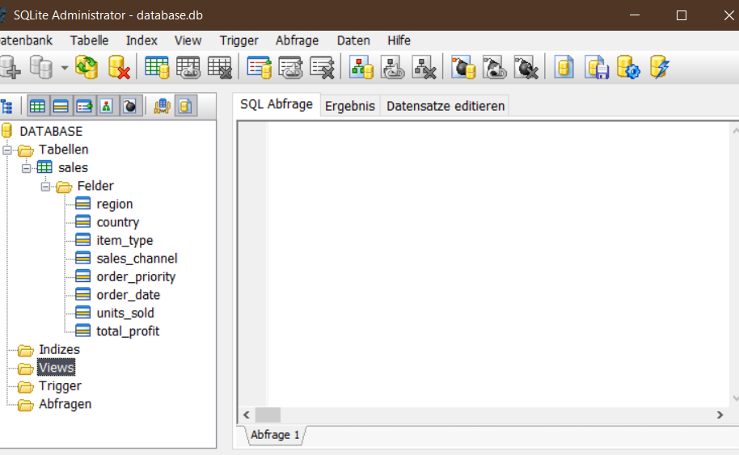
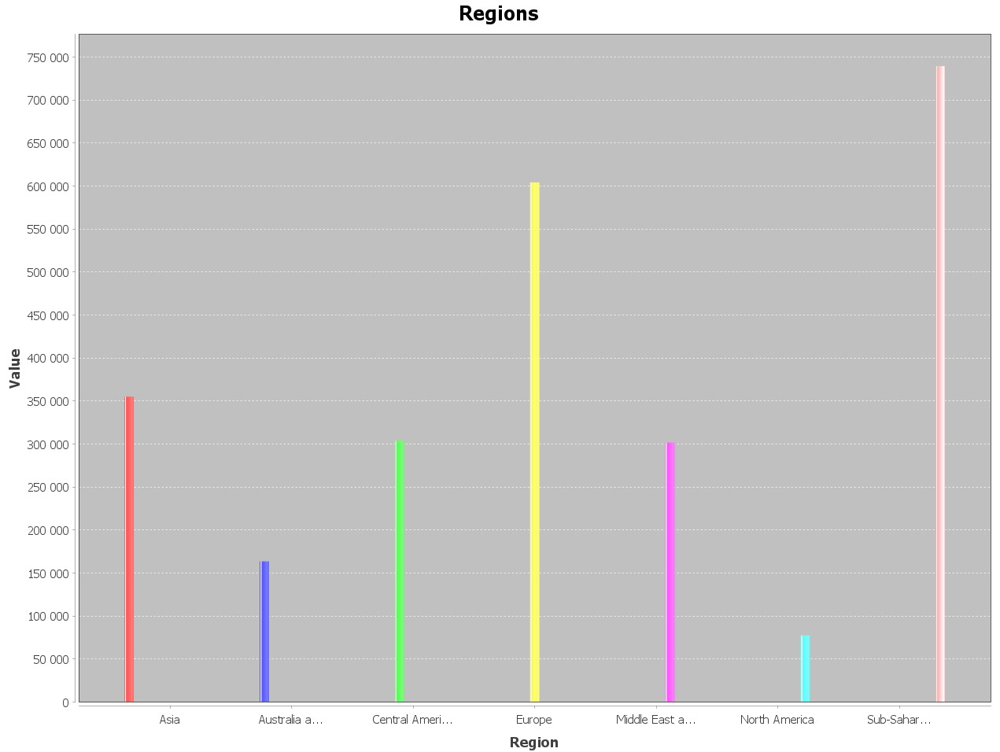
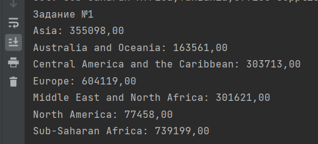
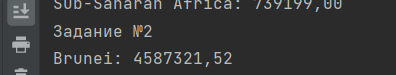
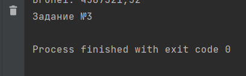

# Последовательность работы по проекту

---

1. Создание базы данных

- Использовался JDBC + SQLite

Код создания:

```sql
CREATE TABLE if not exists sales (
                                     region TEXT,
                                     country TEXT,
                                     item_type TEXT,
                                     sales_channel TEXT,
                                     order_priority TEXT,
                                     order_date TEXT,
                                     units_sold REAL,
                                     total_profit REAL
);
```

Все записи в таблице - уникальные, как следствие таблица уже в 3НФ.

---

2. Добавление данных в БД

- Использовался BufferedReader для построчного чтения

Для начала производится чтение строки из входного файла, 
после чего строка разбивается на отдельные значения
по запятой, которые добавляются в класс Sales и уже 
после берутся как массив объектов.

Пример взятия массива объектов в `Sales`:
```java
public Object[] getArray(){
        List<Object> resList = new ArrayList<>();
        resList.add(region);
        resList.add(country);
        resList.add(item_type);
        resList.add(sales_channel);
        resList.add(order_priority);
        resList.add(order_date);
        resList.add(units_sold);
        resList.add(total_profit);

        return resList.toArray();
        }
```

После чего выполняем запрос и проверяем результат, если `== 1`, 
то все ок.
```java
// executing addition of new element
                var executionResult = ps.executeUpdate();
                        System.out.println("Adding new element, status: " + executionResult);
```

---

# Задание №1

    Постройте график по общему кол-ву проданных товаров, объединив их по регионам

Выполняем запрос, получаем ответ, строим график.
```java
PreparedStatement task1 = conn.prepareStatement("""
                    select region, sum(units_sold) as num
                    from sales
                    group by region
                    """);

        ResultSet r1 = task1.executeQuery();
        System.out.println("Задание №1");

        DefaultCategoryDataset dataset = new DefaultCategoryDataset();
        // getting data
        while (r1.next()) {
        String region = r1.getString("region");
        double profits = r1.getDouble("num");
        System.out.println(region + ": " + String.format("%.2f", profits));
        dataset.addValue(profits, region, region);
        }

        // Create a chart
        JFreeChart chart = ChartFactory.createBarChart(
        "Regions", // chart title
        "Region", // domain axis label
        "Value", // range axis label
        dataset, // data
        PlotOrientation.VERTICAL, // orientation
        false, // include legend
        true, // tooltips?
        false // URLs?
        );

        // Create a panel to display the chart
        ChartPanel panel = new ChartPanel(chart);

        // Create a frame to hold the chart
        JFrame frame = new JFrame("Bar Chart Example");
        frame.setDefaultCloseOperation(JFrame.EXIT_ON_CLOSE);
        frame.add(panel);
        frame.pack();
        frame.setVisible(true);
```

В виде графика:


С консоли:

---

# Задание №2

    Выведите в консоль страну с самым высоким общим доходом среди регионов европы и азии

Код: 
```java
PreparedStatement task2 = conn.prepareStatement("""
                    SELECT country, sum(total_profit) as profits  
                                           FROM sales
                                           WHERE region IN ('Asia', 'Europe')
                                           GROUP BY country
                                           order by profits desc 
                                           limit 1
                    """);

        ResultSet r2 = task2.executeQuery();
        System.out.println("Задание №2");

        // getting data
        while (r2.next()) {
        String county = r2.getString("country");
        double profits = r2.getDouble("profits");
        System.out.println(county + ": " + String.format("%.2f", profits));
        }
```

Результат в консоли: 
``` 
Задание №2
Brunei: 4587321,52
```


--- 

# Задание №3

    Найдите страну с общим доходом 420-440 тыс. среди регионов Бл.Восток-Сев.Африка и Субсах.Африка с самым высоким общим доходом

Код: 
```java
PreparedStatement task3 = conn.prepareStatement("""
                    select * from (
                    SELECT country, sum(total_profit) as profits  
                                           FROM sales
                                           WHERE region IN ('Sub-Saharan Africa', 'Middle East and North Africa')
                                           GROUP BY country
                                           order by profits desc 
                                           )
                    where profits >= 420000 and profits <= 440000
                    """);

        ResultSet r3 = task3.executeQuery();
        System.out.println("Задание №3");

        // getting data
        while (r3.next()) {
        String county = r3.getString("country");
        double avgStudents = r3.getDouble("profits");
        System.out.println(county + ": " + String.format("%.2f", avgStudents));
        }
```
Результат в консоли: 
``` 
Задание №3
<ничего>
```


Как видим, данный запрос не вернул ничего - значит нет стран с таким диапазоном 
дохов. Для проверки, выведем данные без ограничения на 420-440к: 

``` 
Sierra Leone: 5279709,73
Sao Tome and Principe: 3831693,61
Nigeria: 3806755,74
Pakistan: 3645125,67
Namibia: 3283860,21
Tanzania: 3262156,64
Jordan: 3242619,59
Tunisia: 3083143,99
Mauritius: 2936771,84
Lesotho: 2832512,15
Angola: 2737970,25
South Sudan: 2647655,71
Equatorial Guinea: 2566272,99
Botswana: 2540339,36
Afghanistan: 2427572,94
Cameroon: 2369325,82
Liberia: 2141242,39
Comoros: 2017150,93
Mali: 1986622,34
Somalia: 1939094,68
Guinea-Bissau: 1790752,36
Central African Republic: 1623850,61
Egypt: 1448707,68
Morocco: 1406920,79
Kuwait: 1355081,00
Mozambique: 1314041,55
Malawi: 1268872,42
Iran: 1219332,22
Ethiopia: 1043626,10
Gabon: 1039802,52
Lebanon: 1012911,54
Seychelles: 922051,25
Senegal: 897345,46
Cape Verde: 889343,17
Ghana: 865807,52
Djibouti: 858780,24
Yemen: 855272,49
Guinea: 747787,15
Mauritania: 703510,00
Swaziland: 690923,52
The Gambia: 669225,02
Burundi: 635848,04
United Arab Emirates: 630768,38
Bahrain: 616193,99
Benin: 582733,26
Uganda: 508050,40
Syria: 505355,65
Iraq: 491330,80
Niger: 488206,94
South Africa: 484873,78
Togo: 457049,18
Turkey: 440380,43
Democratic Republic of the Congo: 401787,73
Madagascar: 357996,90
Libya: 349697,28
Eritrea: 283343,57
Rwanda: 261674,54
Saudi Arabia: 178902,24
Azerbaijan: 157226,40
Kenya: 156490,38
Sudan: 143602,20
Burkina Faso: 52738,40
Chad: 49718,88
Algeria: 38880,53
Zambia: 4692,27
```

Как видим, стран с доходами в указанном диапазоне действительно нет.
